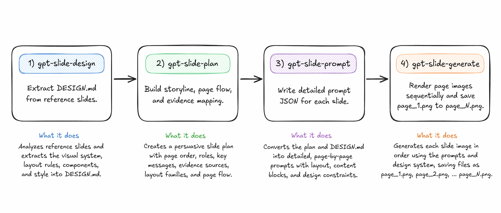

# Future Slide Skill

[English](./README.md) | [한국어](./README.ko.md)


[](./LICENSE)

Navigation: [Workflow](#recommended-workflow) | [Examples](#example-prompts) |
[Install](#installation) | [License](#license)



A reusable skill bundle for turning:

1. a **reference slide image**
2. **user-provided files**
3. a **user prompt / deck request**

into a disciplined four-stage slide-generation workflow:

1. **Extract `DESIGN.md` from the reference slide image**
2. **Build a persuasive slide plan in JSON**
3. **Write page-by-page slide prompts in JSON**
4. **Generate page images sequentially from the prompt JSON**

This bundle is intentionally modeled after the *reason* `gpt-taste` exists in the `taste-skill` repo: not to add more decoration, but to add **stricter enforcement**, stronger anti-default rules, and mandatory pre-flight structure so GPT-class models do not skip steps or collapse into generic output.

## Why this is split into 4 skills

A single prompt often fails in predictable ways:

- it starts writing slides before the theme is extracted
- it mixes design analysis with deck strategy
- it produces page prompts without a real narrative arc
- it loses layout consistency across body slides
- it overfits to the visible text in the reference image instead of the slide *design system*
- it stops after writing prompts and never actually renders numbered slide outputs

So this bundle separates responsibilities:

- **`gpt-slide-design`** → extract a reusable `DESIGN.md`
- **`gpt-slide-plan`** → decide deck logic, ordering, and persuasion
- **`gpt-slide-prompt`** → convert that plan into detailed page prompts
- **`gpt-slide-generate`** → generate slide images sequentially and save them with page-number filenames

## Recommended workflow

Use the skills in this exact sequence:

### 1) `gpt-slide-design`
Inputs:
- reference slide image(s)

Output:
- one `DESIGN.md` focused on presentation design, not slide content

### 2) `gpt-slide-plan`
Inputs:
- extracted `DESIGN.md`
- user files
- user goal / audience / prompt

Output:
- deck plan JSON with slide ordering, narrative flow, and evidence mapping

### 3) `gpt-slide-prompt`
Inputs:
- `DESIGN.md`
- plan JSON
- supporting files if needed

Output:
- slide-by-slide prompt JSON with detailed visual/content instructions

### 4) `gpt-slide-generate`
Inputs:
- `DESIGN.md`
- page-level prompt JSON such as `slide_prompts.json`

Output:
- final slide images saved sequentially into the workspace, for example:
  - `page_1.png`
  - `page_2.png`
  - `page_3.png`

This step is intentionally separate so generation can:
- inspect each page one by one
- preserve deck consistency across outputs
- save project-bound assets explicitly instead of leaving them in tool cache

[Back to top](#future-slide-skill)

## Example prompts

Below are concrete example prompts based on the actual way these skills were used for the Samsung Biologics / Hana Securities workflow.

### `gpt-slide-design`

Use when you have a reference slide image or reference deck image and want to extract a reusable design system.

Example:

```text
$gpt-slide-design [Image #1]
```

More explicit example:

```text
$gpt-slide-design
Extract the design theme from this reference slide image.
Focus on official DESIGN.md output with layout placement, header/body/footer flow,
title page / body page / end page flow, icon usage, infographic cards, and diagram behavior.
```

### `gpt-slide-plan`

Use when you already have `DESIGN.md` and want to build the storyline and slide sequence from files plus user intent.

Example:

```text
$gpt-slide-plan /Users/tonylee/Downloads/하나증권 _보고서.pdf
Write the analysis slide for 'Samsung Biologics' in Korean based on report pdf file.
```

Expanded full-deck example:

```text
$gpt-slide-plan /Users/tonylee/Downloads/하나증권 _보고서.pdf
Create a more detailed full deck in Korean from this equity research report.
Keep the structure analytical and report-native.
Plan title page, body pages, end page, and appendix/disclosure flow.
```

### `gpt-slide-prompt`

Use after planning is complete and you want detailed page-level prompt JSON for slide generation.

Minimal example:

```text
$gpt-slide-prompt
```

More explicit example:

```text
$gpt-slide-prompt
Use the current DESIGN.md and slide_plan.json.
Generate strict page-by-page prompt JSON with explicit header/body/footer zoning,
table/chart/card hierarchy, icon rules, and anti-generic constraints.
```

### `gpt-slide-generate`

Use after `slide_prompts.json` exists and you want actual slide images rendered sequentially.

Minimal example:

```text
$gpt-slide-generate
```

More explicit example:

```text
$gpt-slide-generate
Based on @slide_prompts.json, create all slide images 1 by 1 and save them
with the page_number naming rule.
```

Full-deck example:

```text
$gpt-slide-generate
Use DESIGN.md and slide_prompts.json.
Render the full deck sequentially and save:
page_1.png ... page_N.png
```

[Back to top](#future-slide-skill)

## Example end-to-end usage

Typical sequence:

```text
$gpt-slide-design [reference slide image]
$gpt-slide-plan /path/to/report.pdf Create a full Korean research-summary deck.
$gpt-slide-prompt
$gpt-slide-generate
```

## What this bundle optimizes for

- theme extraction first, content second
- strong cross-slide consistency
- persuasive story flow
- explicit evidence-to-slide mapping
- reusable layout families
- body-slide discipline
- title / body / end-page flow discipline
- explicit header / body / footer zoning
- icon / infographic / table / chart role clarity
- sequential image generation with stable numbering
- no hallucinated design rules when the reference image is ambiguous

## Output artifacts

This bundle includes:
- `skills/gpt-slide-design/SKILL.md`
- `skills/gpt-slide-plan/SKILL.md`
- `skills/gpt-slide-prompt/SKILL.md`
- `skills/gpt-slide-generate/SKILL.md`
- `templates/DESIGN_TEMPLATE.md`

## Current skill responsibilities

### `gpt-slide-design`
- extracts design theme, placement rules, header/body/footer flow, title/body/end-page behavior
- captures icon usage, infographic card logic, table/chart treatment, and diagram behavior

### `gpt-slide-plan`
- builds the storyline and page-family rhythm
- decides where tables, charts, icon-led modules, or comparison exhibits belong
- plans split topics across multiple pages when needed

### `gpt-slide-prompt`
- converts the plan into strict per-page prompt JSON
- makes layout family, zoning, and anti-generic rules explicit for every page

### `gpt-slide-generate`
- reads `DESIGN.md` and prompt JSON
- renders slide images one by one with Codex native image generation
- saves final outputs into the project using page-number naming

## Recommended generated artifact set

For a full run, the typical artifact chain is:

1. `DESIGN.md`
2. `slide_plan.json`
3. `slide_prompts.json`
4. `page_1.png ... page_N.png`

[Back to top](#future-slide-skill)

## Installation

### Install with `npx skills`

Use the Skills CLI from a terminal with Node.js 18+:

```bash
npx skills add jyoung105/future-slide-skill
```

You can also use the repository URL:

```bash
npx skills add https://github.com/jyoung105/future-slide-skill.git
```

Restart Codex after installation so the new skills are discovered.

### Manual install into `.codex`

Download or clone this repository, then copy the skill folders into your
Codex skills directory:

```bash
mkdir -p ~/.codex/skills
cp -R skills/gpt-slide-design ~/.codex/skills/
cp -R skills/gpt-slide-plan ~/.codex/skills/
cp -R skills/gpt-slide-prompt ~/.codex/skills/
cp -R skills/gpt-slide-generate ~/.codex/skills/
```

For project-local installation, copy the same folders into:

```text
.codex/skills/
```

Codex discovers skills from folders that contain `SKILL.md`, so each copied
folder must keep its `SKILL.md` at the folder root.

[Back to top](#future-slide-skill)

## License

Future Slide Skill is released under the [Apache License 2.0](./LICENSE).

[Back to top](#future-slide-skill)
